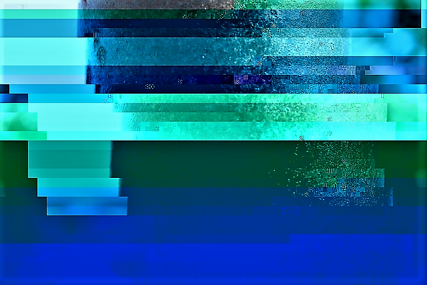

# FOSC photos that I tooked a while ago 💯
Repo made with the intention to publish to the broader public a collection of images that I snapped and considered interesting to publish as FOSC (Free Open Source Content)

---

## Uploaded photos
- ### droplets

- ### glitch 💘

- ### le vegas

- ### mechanisms of creation

- ### neutral type beat 💘

- ### orbs

- ### pole of perspective 💘

- ### the eye of the beholder

- ### umbrella

- ### warm light of fortune 💘


---

## Why bother doing this?
I'm confident that sharing a few of many photos that I snapped as an amateur photograph enthusiasts may encourage others to do the same, and not losing the pieces to the test of my memory and storage space in my PC. Granting these pics as actual FOSC is for the whole purpose to share what I believe to be memorable photos that just need to be out in the wild, that is why the license chosen will suffice for the purposes of this repo.

---

## Technical details
Every photograph is inside its respective folder where it can be found the source image, and it's metadata; I considered to include the metadata for the more knowledgeable photographers that may be interested in the technicalities of the uploaded sources. The metadata was obtained in a Windows 10 machine using the CLI tool known as [*exiftool*](https://exiftool.org/) which extracts the metadata of a given input in an EXIF style format. The command used for piping the output of the tool into a .txt file is as follows ([*Relevant StackOverFlow post*](https://stackoverflow.com/questions/9464617/retrieving-and-saving-media-metadata-using-ffmpeg)):

```bash
exiftool IMAGE > metadata.txt
```

---

## Final thoughts
Doing this for fun is what I've been doing with many things throughout life, so sharing the content as public domain is a great endeavor for not letting this material go to waste. I encourage others to do the same. 

**Enjoy!!!**

---

<a href="https://es.cooltext.com"></a>
<br />Image by <a href="https://es.cooltext.com">Cool Text: Free Logos and Buttons</a> - <a href="https://es.cooltext.com/Edit-Logo?LogoID=4040554153">Create An Image Just Like This</a>

COOL IMAGES LINK: https://images.cooltext.com/5582469.gif
